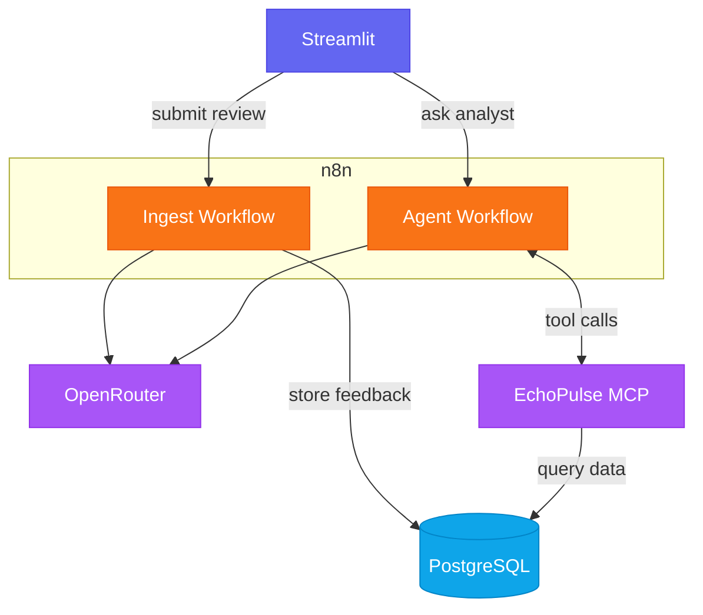

# EchoPulse

Customer feedback platform built with Streamlit, n8n, MCP, and PostgreSQL.

## Architecture



## Quick start

```bash
cp .env.example .env
docker compose up -d --build
```

| Service   | URL                          |
|-----------|------------------------------|
| Streamlit | http://localhost:8501        |
| n8n       | http://localhost:5678        |
| MCP (SSE) | http://localhost:8000/sse    |
| Postgres  | localhost:5433 (host port)   |

## n8n setup

1. Import `n8n/ingest_workflow.json` and `n8n/agent_workflow.json`
2. Add **OpenRouter** credentials to both workflows
3. Add **Postgres** credentials to the ingest workflow:
   - Host: `postgres`
   - Port: `5432`
   - Database: `echopulse`
4. Activate both workflows

## Local development

```bash
uv sync
uv run python mcp/mcp_server.py
uv run streamlit run streamlit/app.py
```

Set webhook URLs in `.env` when running Streamlit outside Docker (see `.env.example`).
